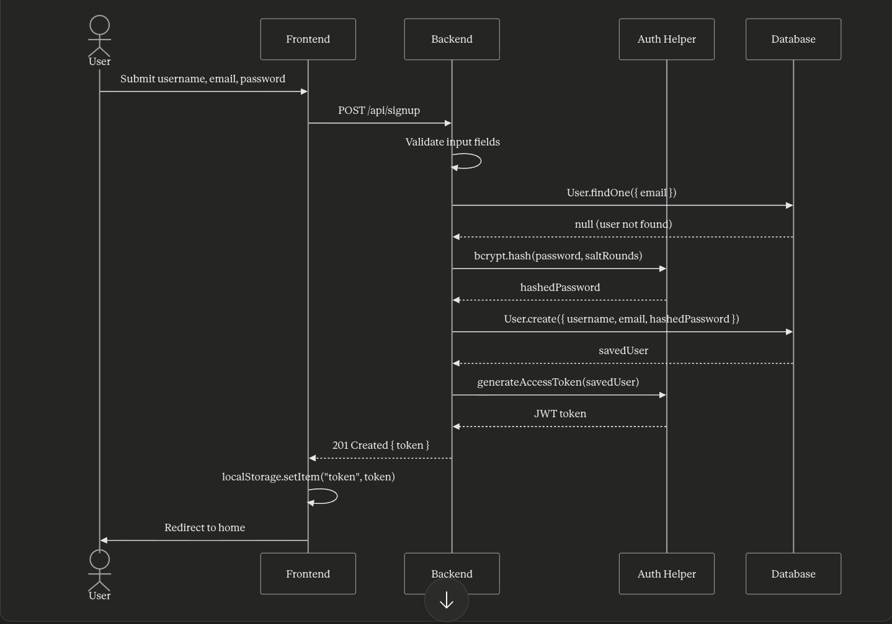
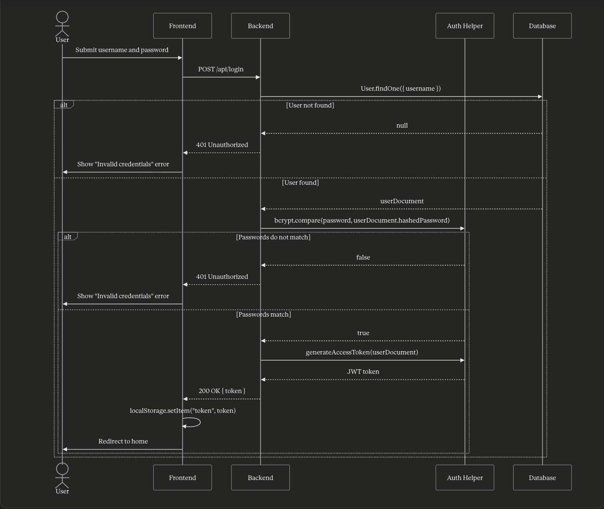
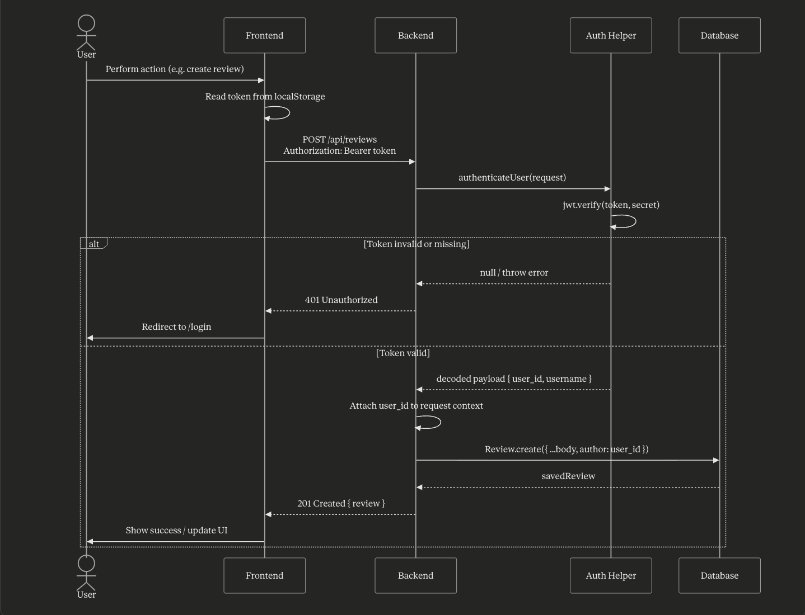

## Meetia

CSC 307 Intro to Software Engineering Final Project

Group Members: Morgan Blanck, Alex Hanus, Trotter McLemore, Ben Varni, Nathan Victorino

## Project Description

This project is designed for media enthusiasts who want a space to share their thoughts and recommendations. Meetia is a media tracking and social cataloging app that allows users to store all types of media, unlike similar apps such as GoodReads or Letterboxd which are limited to only one type of media. This app has social media features that allow users to explore reviews posted by others, make comments on reviews, and add friends. However, this app is also suited for users who simply want a place to track their favorite media and create collections.

## Azure Deployment Link

https://thankful-coast-07313380f.7.azurestaticapps.net/

## Development Environment Setup

1. Create an account and log in to Mongo Atlas
2. Click "generate a connection string"
3. Create a file called ".env" outside of all folders (in top level Meetia/ folder)
4. Inside .env, write "MONGODB_URI=["copied connection string"]"

This is a [Next.js](https://nextjs.org) project bootstrapped with [`create-next-app`](https://nextjs.org/docs/app/api-reference/cli/create-next-app).

### Getting Started

First, run the development server:

```bash
npm run dev
# or
yarn dev
# or
pnpm dev
# or
bun dev
```

Open [http://localhost:3000](http://localhost:3000) with your browser to see the result.

You can start editing the page by modifying `app/page.js`. The page auto-updates as you edit the file.

This project uses [`next/font`](https://nextjs.org/docs/app/building-your-application/optimizing/fonts) to automatically optimize and load [Geist](https://vercel.com/font), a new font family for Vercel.

## Project Board

We used a Jira Board to log tasks for this project rather than using GitHub issues. Here's a link to our board: https://calpoly-team-z6mb6mwx.atlassian.net/jira/software/projects/TM/boards/34?atlOrigin=eyJpIjoiNjViYjk3YjRjOTdkNGFmNWExMDRmMWQ5NTdkZGVmMDEiLCJwIjoiaiJ9

## UI Prototype

Link to UI Prototype: https://www.figma.com/design/q8Vey0Q2QpcnVKNL4FqXSW/Meetia-UI-Protoype?node-id=0-1&t=hWMrqv0TnpV0Ctj6-1

Created on 4/29/2026

## UML Diagram

Link to UML Diagram: https://www.figma.com/board/svIRaRQqkGbKHCSx2ukyEC/Class-Diagram?t=hWMrqv0TnpV0Ctj6-1

Last updated on 6/5/2026

## Access Control

### Signup flow



<br>

### Login flow



<br>

### Protected flow



## Contributing

We format our JSX according to the standard Prettier style guide: https://facebook.github.io/jsx/

To contribute, please install **Prettier** and **ESLint**. Both can be easily installed using the VScode extensions tab.
We use the default configurations in both plugins.

To learn more about Next.js, take a look at the following resources:

- [Next.js Documentation](https://nextjs.org/docs) - learn about Next.js features and API.
- [Learn Next.js](https://nextjs.org/learn) - an interactive Next.js tutorial.

You can check out [the Next.js GitHub repository](https://github.com/vercel/next.js) - your feedback and contributions are welcome!
